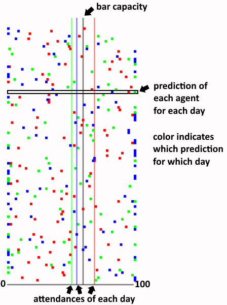
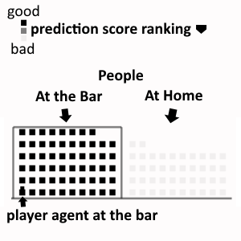
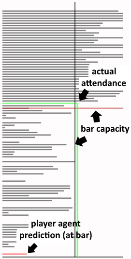
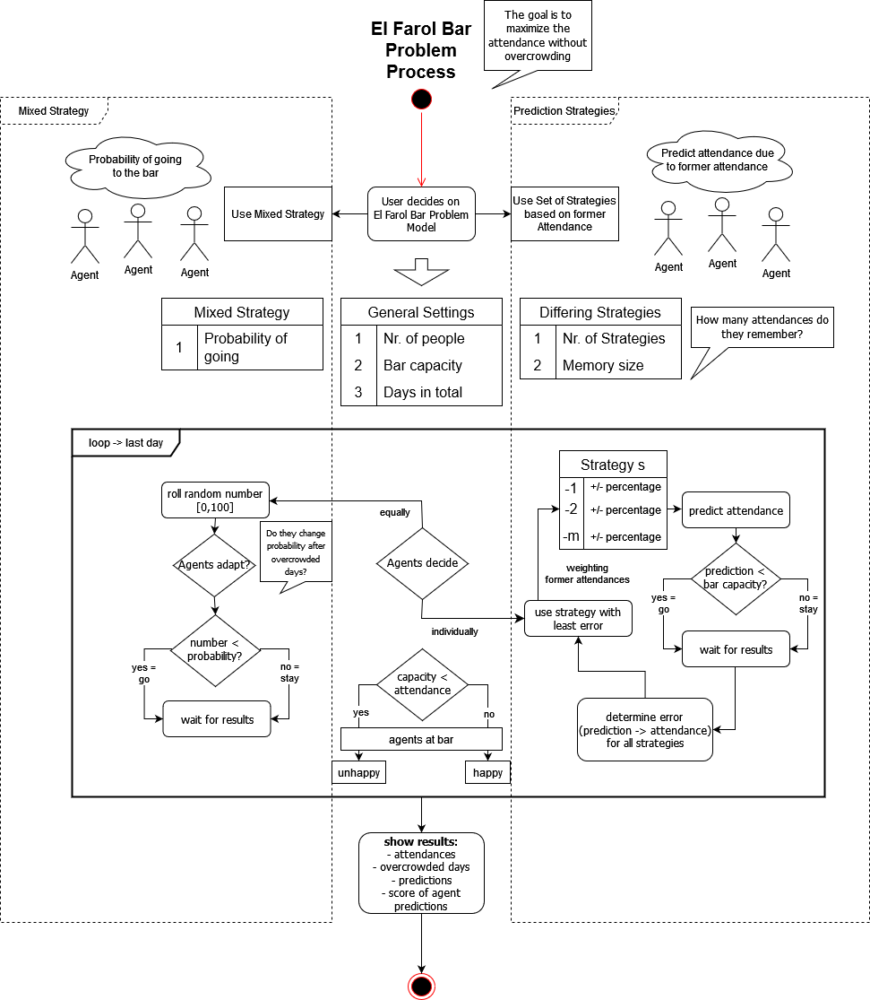
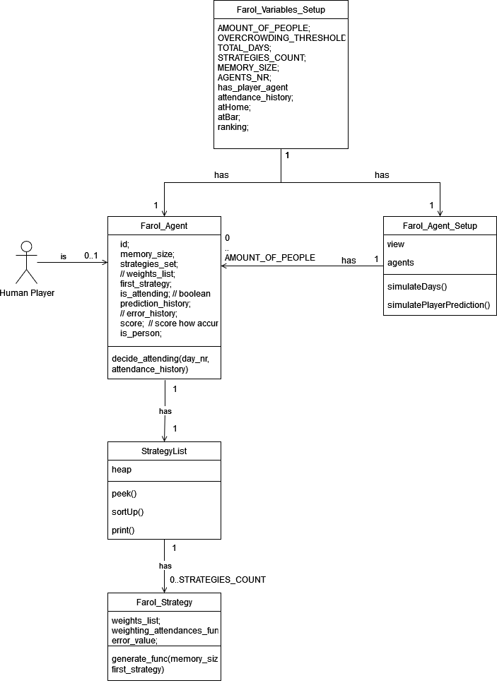

# El Farol Bar Problem - Visualization

This Site should demonstrate the Santa Fe / El Farol Bar Problem with changeable parameters made by M-Gentes in cooperation with Professor Dr. Oscar Lin.

The basic idea is that a specific number of
people want to go to the Bar named "El Farol" on a specific day (like Thursday night). They can decide to go
to the bar or to stay at home. But if
the bar is too crowded the people are unhappy. The maximum number indicating when the bar attendees are
unhappy can
be called as
capacity or threshold of the bar.

## Learning Objectives of the El Farol Bar Problem

- explain the concept of [congestion games](https://en.wikipedia.org/wiki/Congestion_game)

## Images

- all day predictions description
    - 

- bar day attendance description
    - 

- bar day prediction description
    - 

- El Farol process diagramm
    - 

- El Farol code diagramm
    - 
## Credits

Sounds of Freesound.org were used on this application.

- "Cheers, A.wav" by Moulaythami of Freesound.org
- "Ui sounds - Shimmering success.wav" by NXRT of Freesound.org
- "Wrong.mp3" by Raclure of Freesound.org